# Stage 2 — Project Charter / Charte de projet
*Version 1.6 — 2025-09-12*

**Project / Projet :** Open NAS Manager  
**Author / Auteur :** Ivane Bagashvili (Holberton School)  
**Stage 2 Period / Période Étape 2 :** **2025-09-01 → 2025-09-12**  
**Distribution / Diffusion :** Instructors, Reviewers, Early Testers

**Executive Summary (EN)**  
Open NAS Manager is a mobile app that delivers fast, secure TrueNAS monitoring and one-tap control of core services. The MVP covers token + biometric login, a lightweight dashboard (CPU/RAM/uptime), reliable service toggles (SMB/NFS/SSH), and **remote access via Tailscale** when the device and server are on the same tailnet.

**Résumé exécutif (FR)**  
Open NAS Manager est une application mobile qui offre un suivi TrueNAS rapide et sécurisé avec contrôle des services en un geste. Le MVP couvre la connexion token + biométrie, un tableau de bord léger (CPU/RAM/uptime), des bascules fiables (SMB/NFS/SSH) et **l’accès distant via Tailscale** lorsque l’appareil et le serveur sont sur le même tailnet.

---
[🇬🇧 English](#-english-version) · [🇫🇷 Français](#-version-française)

## 🇬🇧 English Version

### 1) Project Objectives (Purpose + SMART)

**Purpose**  
Provide a fast, secure mobile experience to check a TrueNAS server and toggle essential services without using the desktop Web UI.

**Background**  
Stage 1 ideation combined mind mapping and **SCAMPER** (Substitute, Combine, Adapt, Modify, Put to use, Eliminate, Reverse), surfacing quick wins like one-tap service toggles and token-based login.

**SMART objectives (assessed by end of Stage 4 — 2025-10-24)**

| Objective | Target (Time-bound) | Measurement Method | Success Threshold |
|---|---|---|---|
| **Time-to-status (LAN)** | p95 **≤ 2s** by 2025-10-24 | In-app timer (open → dashboard), 30 sessions | Met in **≥ 80%** of runs |
| **Time-to-status (Tailscale)** | p95 **≤ 3s** by 2025-10-24 | Same timer with device/server on same tailnet | Met in **≥ 80%** of runs |
| **Secure login** | **0 secrets in plaintext**, biometrics enforced by 2025-10-24 | Static checks + unit/integration tests in CI | **100%** CI pass for auth/error paths |
| **Service toggles** | **≤ 3 taps**, **≥ 99% success** by 2025-10-24 | 20 trials per tester (SMB/NFS/SSH) | **≥ 99%** success; failures triaged & fixed |

**KPI reporting**  
Weekly snapshot in README: p95 latency (LAN/Tailscale), toggle success rate, CI pass rate, open defects by severity.

---

### 2) Stakeholders and Roles

| Stakeholder | Interest | Role / RACI |
|---|---|---|
| **Ivane Bagashvili** | Ship a usable MVP | **R/A** development & scope; **C** testing/release |
| **Holberton instructors** | Review & grading | **C** checkpoints/requirements; **I** progress |
| **Early testers (home-lab / small teams)** | Usability & reliability | **C** feedback sessions; **I** fixes |
| **Future & current NAS owners** | Adoption | **C** expectations; **I** roadmap |
| **TrueNAS docs/community** | API reference | **I** only |

*R = Responsible, A = Accountable, C = Consulted, I = Informed*  
**Communication**: weekly status summary + short demo; decisions/risks/issues tracked in GitHub (list view), linked to commits/PRs.

---

### 3) Scope

**In scope (MVP)**  
One TrueNAS server; secure token storage in **Android Keystore** (Keychain if iOS later); dashboard with **CPU, RAM, uptime** and pull-to-refresh; enable/disable **SMB, NFS, SSH** with confirmations; basic settings (server URL, token, biometric lock); **remote access via Tailscale** when device and server share the same tailnet (MagicDNS or 100.x reachable; Tailscale app installed and connected).

**Out of scope (MVP)**  
Multi-server; notifications (SMART/temperature); file-browser writes (read-only may come later via WebDAV); **Cloudflare Tunnel**; ZFS/dataset management, backups/snapshots; voice assistant/orchestration.

**Assumptions & constraints**  
Default **LAN** usage; **Tailscale** supported with same-tailnet devices; **TrueNAS v2 REST** only; **Android first** (min SDK 24); biometrics available; token pre-created by admin. No Cloudflare Tunnel, multi-server, or ZFS management in MVP.

---

### 4) Risks and Mitigation

| Risk | Mitigation |
|---|---|
| Self-signed certificates / LAN quirks | Use valid certs or secure tunnels; controlled HTTP client; clear error UX |
| API differences / breaking changes | Target TrueNAS v2; service-layer abstraction; endpoint smoke tests |
| Solo-developer bandwidth | Small tasks; CI; strict MVP scope; weekly review |
| Security regressions | Keystore + biometrics; no plaintext tokens; auth tests; review checklist |
| **Tailscale dependency / ACL issues** | Document prerequisites; test LAN vs Tailscale paths; diagnostics (tailnet, DNS, ACL) |
| Store compliance (if Pro later) | Early policy review; optional, documented telemetry |

**Dependencies**  
TrueNAS v2 API availability; stable local network; Android Keystore (Keychain if iOS later); **Tailscale app with device/server on same tailnet**; tester availability for usability sessions.

---

### 5) High-Level Plan

| Stage | Dates | Key deliverables |
|---|---|---|
| **Stage 1 — Idea Development** | 2025-08-18 → 2025-08-29 | Stage 1 report approved |
| **Stage 2 — Project Charter** | **2025-09-01 → 2025-09-12** | Charter finalized |
| **Stage 3 — Technical Docs** | 2025-09-15 → 2025-09-26 | API contracts, error model, screen map & wireframes |
| **Stage 4 — MVP Development** | 2025-09-29 → 2025-10-24 | Auth + secure storage → dashboard → service toggles → polish/tests |
| **Stage 5 — Closure** | 2025-10-27 → 2025-11-07 | Demo video, tester feedback, README, optional beta |

**Timeline tools (for reviewers)**  
The plan above is maintained in GitHub Projects (list view) and mirrored as a Gantt for quick visual checks. The same dates are reflected in a Mermaid diagram (below) and can be exported as an image from:
- Mermaid (in-repo preview)
- Gantt.com (simple web editor)

**Visual plan (Gantt)**

```mermaid
gantt
  title High-Level Plan (Stage 2 → 5)
  dateFormat  YYYY-MM-DD
  section Planning
  Stage 2 — Project Charter      :done,    s2, 2025-09-01, 2025-09-12
  Stage 3 — Technical Docs       :active,  s3, 2025-09-15, 2025-09-26
  section Delivery
  Stage 4 — MVP Development      :         s4, 2025-09-29, 2025-10-24
  - Auth + Secure Storage        :         a1, 2025-09-29, 2025-10-03
  - Dashboard                    :         a2, 2025-10-04, 2025-10-10
  - Service Toggles              :         a3, 2025-10-11, 2025-10-17
  - Polish & Tests               :         a4, 2025-10-18, 2025-10-24
  section Closure
  Stage 5 — Closure              :         s5, 2025-10-27, 2025-11-07
```

---

## 🇫🇷 Version Française

### 1) Objectifs (But + SMART)

**But**  
Offrir sur smartphone une expérience rapide et sécurisée pour consulter l’état d’un TrueNAS et (dés)activer les services clés, sans passer par l’UI Web desktop.

**Contexte**  
À l’étape 1, l’idéation a combiné le mind map et **SCAMPER** (Substituer, Combiner, Adapter, Modifier, Détourner, Éliminer, Inverser), révélant des gains rapides comme l’interrupteur 1-tap et la connexion par token.

**Objectifs SMART (évalués fin Étape 4 — 24-10-2025)**

| Objectif | Cible (datée) | Méthode de mesure | Seuil de succès |
|---|---|---|---|
| **Temps d’affichage (LAN)** | p95 **≤ 2 s** d’ici le 24-10-2025 | Timer in-app (ouverture → dashboard), 30 sessions | Atteint sur **≥ 80 %** des runs |
| **Temps d’affichage (Tailscale)** | p95 **≤ 3 s** d’ici le 24-10-2025 | Même timer avec appareil/serveur sur même tailnet | Atteint sur **≥ 80 %** des runs |
| **Connexion sécurisée** | **0 secret en clair**, biométrie active d’ici le 24-10-2025 | Analyses statiques + tests unitaires/intégration en CI | **100 %** de réussite CI (auth/erreurs) |
| **Bascule des services** | **≤ 3 tapes**, **≥ 99 % de réussite** d’ici le 24-10-2025 | 20 essais (SMB/NFS/SSH) par testeur | **≥ 99 %** ; échecs triés et corrigés |

**Indicateurs & suivi**  
KPI hebdomadaires dans le README : latence p95 (LAN/Tailscale), réussite des bascules, taux de réussite CI, défauts par sévérité.

---

### 2) Parties prenantes et rôles

| Partie prenante | Intérêt | Rôle / RACI |
|---|---|---|
| **Ivane Bagashvili** | Livrer un MVP utile | **R/A** dev & périmètre ; **C** tests/release |
| **Encadrants Holberton** | Suivi & évaluation | **C** jalons/exigences ; **I** avancement |
| **Testeurs (home-lab / petites équipes)** | Retours d’usage | **C** sessions de tests ; **I** correctifs |
| **Propriétaires de NAS (actuels/futurs)** | Adoption | **C** attentes ; **I** feuille de route |
| **Docs/communauté TrueNAS** | Référence API | **I** uniquement |

*R = Responsable, A = Approbateur, C = Consulté, I = Informé*  
**Communication** : point d’avancement hebdo + courte démo ; décisions/risques/sujets suivis dans GitHub (vue liste), liés aux commits/PR.

---

### 3) Périmètre

**Dans le périmètre (MVP)**  
Un serveur TrueNAS ; stockage sécurisé du token dans l’**Android Keystore** (Keychain si iOS plus tard) ; tableau de bord **CPU, RAM, uptime** avec pull-to-refresh ; ON/OFF **SMB, NFS, SSH** avec confirmations ; réglages (URL, token, biométrie) ; **accès distant via Tailscale** lorsque l’appareil et le serveur sont sur le même tailnet (MagicDNS ou 100.x joignable ; app Tailscale installée et connectée).

**Hors périmètre (MVP)**  
Multi-serveurs ; notifications (SMART/température) ; écriture via explorateur/WebDAV (lecture seule possible plus tard) ; **Cloudflare Tunnel** ; gestion ZFS/datasets, sauvegardes/snapshots ; assistant vocal/orchestrateur.

**Hypothèses & contraintes**  
Usage **LAN** par défaut et **Tailscale** si les deux extrémités partagent un tailnet ; API **v2** uniquement ; **Android d’abord** (SDK min 24) ; appareil avec biométrie ; token créé par un admin. Pas de Cloudflare Tunnel, pas de multi-serveurs, pas de gestion ZFS au MVP.

---

### 4) Risques et atténuation

| Risque | Atténuation |
|---|---|
| Certificats auto-signés / réseau domestique | Certificat valide ou tunnel ; client HTTP contrôlé ; messages d’erreur clairs |
| Écarts ou ruptures d’API | Cibler TrueNAS v2 ; couche service ; tests « smoke » |
| Charge d’un dev solo | Petites tâches ; CI ; périmètre strict ; revue hebdomadaire |
| Régressions sécurité | Keystore + biométrie ; aucun token en clair ; tests d’auth ; checklist |
| **Dépendance Tailscale / ACL** | Pré-requis documentés ; tests LAN vs Tailscale ; diagnostics (tailnet, DNS, ACL) |
| Conformité store (si Pro) | Lecture des politiques en amont ; télémétrie optionnelle et documentée |

**Dépendances**  
Disponibilité de l’API TrueNAS v2 ; réseau local stable ; Android Keystore (Keychain si iOS plus tard) ; **app Tailscale avec appareil/serveur sur le même tailnet** ; disponibilité des testeurs.

---

### 5) Plan haut niveau (daté)

| Étape | Dates | Livrables clés |
|---|---|---|
| **Étape 1 — Dév. de l’idée** | 18 → 29 août 2025 | Rapport validé |
| **Étape 2 — Charte** | **1 → 12 septembre 2025** | Charte finalisée |
| **Étape 3 — Docs techniques** | 15 → 26 septembre 2025 | Contrats API, modèle d’erreurs, plan d’écrans & wireframes |
| **Étape 4 — Dév. MVP** | 29 septembre → 24 octobre 2025 | Auth + stockage sécurisé → dashboard → ON/OFF services → finitions & tests |
| **Étape 5 — Clôture** | 27 octobre → 7 novembre 2025 | Vidéo démo, retours testeurs, README, bêta éventuelle |

**Outils de timeline (pour les relecteurs)**  
Le plan ci-dessus est maintenu dans GitHub Projects (vue liste) et reflété en **Gantt** pour une lecture rapide. Les mêmes dates sont reprises dans le diagramme Mermaid (ci-dessous) et peuvent être exportées en image depuis :
- Mermaid (aperçu dans le repo)
- Gantt.com (éditeur web simple)

**Diagramme (Gantt)**

```mermaid
gantt
  title Plan haut niveau (Étape 2 → 5)
  dateFormat  YYYY-MM-DD
  section Planification
  Étape 2 — Charte           :done,    s2, 2025-09-01, 2025-09-12
  Étape 3 — Docs techniques  :active,  s3, 2025-09-15, 2025-09-26
  section Réalisation
  Étape 4 — Dév. MVP         :         s4, 2025-09-29, 2025-10-24
  - Auth + Stockage sécurisé :         a1, 2025-09-29, 2025-10-03
  - Dashboard                :         a2, 2025-10-04, 2025-10-10
  - ON/OFF services          :         a3, 2025-10-11, 2025-10-17
  - Finitions & Tests        :         a4, 2025-10-18, 2025-10-24
  section Clôture
  Étape 5 — Clôture          :         s5, 2025-10-27, 2025-11-07
```

---
